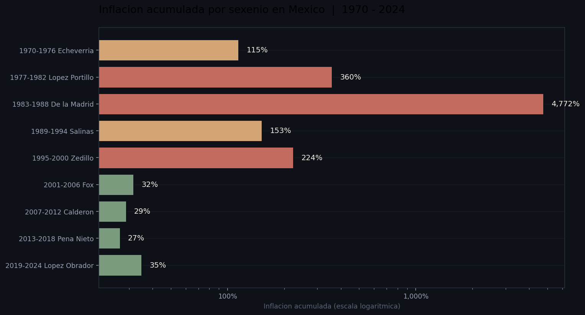
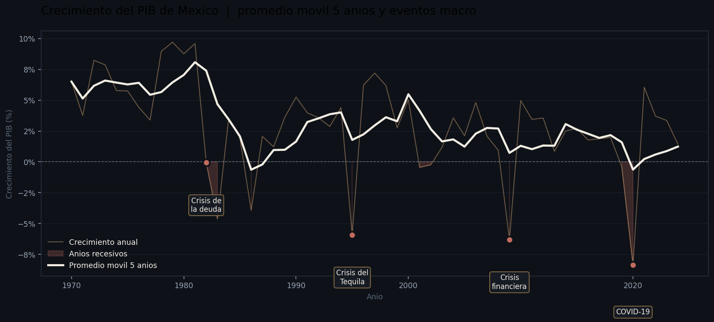
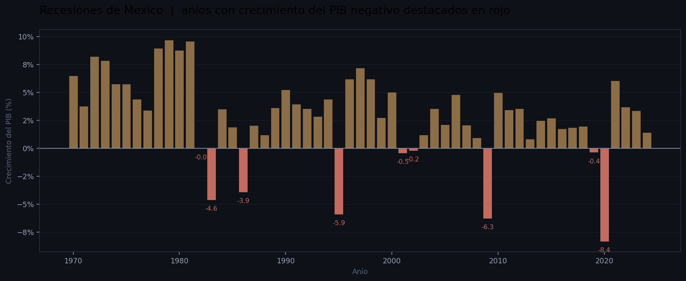
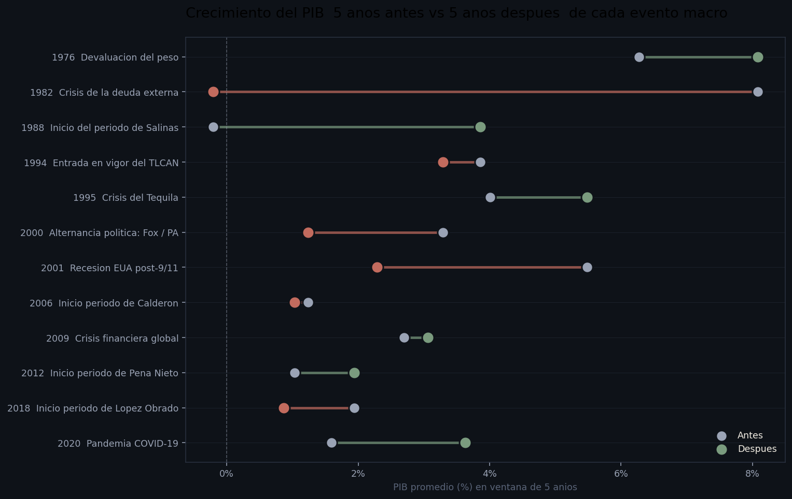

# Observatorio macroeconómico de México · SQL puro

Análisis de **65 años de indicadores económicos oficiales** de México (1960–2024) construido **completamente en SQL** sobre DuckDB. Cero pandas, cero notebooks. Quince queries con CTEs, window functions, agregaciones jerárquicas, pivots y self-joins, cada una con un objetivo de negocio claro.

## Qué problema resuelve

La pregunta detrás del proyecto: **¿cómo se ve la economía mexicana en los últimos 65 años?** ¿En qué sexenio se devaluó más fuerte el peso? ¿Cuál fue el peor año macroeconómico? ¿Cómo se comportó el PIB antes y después del TLCAN, del Tequilazo, del COVID? ¿Hay correlación entre desempleo e inflación?

Todas esas preguntas se responden aquí con SQL — sin frameworks intermedios, sin scripts de visualización. El SQL **es** el producto.

## Por qué este proyecto

La mayoría de portafolios de "data analyst" muestran código Python masticando datos en pandas y entregando un gráfico al final. Este proyecto demuestra lo contrario: **dominio puro del lenguaje en el que están escritas todas las bases de datos relacionales**. Si en una entrevista te preguntan por window functions, CTEs recursivas o agregaciones con `ROLLUP`, aquí están aplicadas a datos reales con resultados interpretables.

## Stack

| Componente | Por qué |
|---|---|
| **DuckDB 1.5+** | El "SQLite moderno". Lee CSV/parquet directamente, sin servidor, sin configuración. Implementa SQL ANSI 2023 con todas las window functions y operadores avanzados. |
| **SQL puro** | Las 15 queries viven como archivos `.sql` independientes. Cualquiera puede abrirlas en DBeaver, DataGrip, o psql contra Postgres y correrlas con cambios mínimos. |
| **Python (mínimo)** | Solo para tres tareas mecánicas: descargar el CSV del Banco Mundial, crear el esquema en DuckDB, y ejecutar cada `.sql` para regenerar el reporte de resultados. **Cero pandas, cero análisis en Python**. |

## Fuente de datos

**World Bank Indicators API** — endpoint público, sin token, URLs estables. La fuente que usan los economistas y periodistas serios para datos internacionales comparables.

- URL base: `https://api.worldbank.org/v2/country/MEX/indicator/<CODE>?format=json`
- 15 indicadores macroeconómicos descargados, 1960–2024
- ~760 observaciones totales tras consolidación

| Indicador | Código WB | Periodo | Unidad |
|---|---|---|---|
| PIB nominal | NY.GDP.MKTP.CD | 1960–2024 | USD corrientes |
| Crecimiento del PIB | NY.GDP.MKTP.KD.ZG | 1961–2024 | % anual |
| PIB per cápita | NY.GDP.PCAP.CD | 1960–2024 | USD |
| Inflación | FP.CPI.TOTL.ZG | 1960–2024 | % anual |
| Tasa de interés real | FR.INR.RINR | 1993–2024 | % anual |
| Desempleo | SL.UEM.TOTL.ZS | 1991–2025 | % de la PEA |
| Exportaciones | NE.EXP.GNFS.CD | 1960–2024 | USD |
| Importaciones | NE.IMP.GNFS.CD | 1960–2024 | USD |
| Inversión extranjera directa | BX.KLT.DINV.CD.WD | 1970–2024 | USD |
| Deuda externa | DT.DOD.DECT.CD | 1970–2024 | USD |
| Población | SP.POP.TOTL | 1960–2024 | habitantes |
| Gasto público en educación | SE.XPD.TOTL.GD.ZS | 1989–2022 | % del PIB |
| Gasto en salud | SH.XPD.CHEX.GD.ZS | 2000–2023 | % del PIB |
| Emisiones CO₂ per cápita | EN.GHG.CO2.PC.CE.AR5 | 1970–2024 | toneladas |
| Índice de Gini | SI.POV.GINI | 1984–2024 | 0–100 |

Sobre estos indicadores se construye también un **catálogo de 13 eventos macro mexicanos** (devaluación '76, crisis de la deuda '82, TLCAN '94, Tequilazo '95, alternancia 2000, crisis 2009, COVID 2020, etc.) para hacer queries de segmentación "antes vs. después".

## Esquema de la base

Cuatro objetos en DuckDB:

```
indicadores_wide        66 filas, 16 cols       (1 fila por año, indicadores en columnas)
indicadores_long       760 filas, 3 cols        (formato tall: año, indicador, valor)
catalogo_indicadores    15 filas                 (código WB, nombre, unidad)
eventos_macro           13 filas                 (año, evento, categoría)
v_anio_con_eventos      vista                    (wide + eventos del año, agregados)
v_indicadores_etiquetados vista                  (long enriquecido con catálogo)
```

Disponer del mismo dato en `wide` y `long` no es redundancia — cada forma sirve naturalmente a un tipo distinto de query.

## Las 15 queries y qué demuestra cada una

| # | Query | Habilidad técnica que demuestra |
|---|---|---|
| 01 | Evolución del PIB con variación YoY | `LAG()`, `ROW_NUMBER() OVER` |
| 02 | Top 10 años de mayor inflación | `RANK()`, `STRING_AGG()`, JOIN con eventos |
| 03 | Inflación acumulada compuesta por sexenio | CTE + `CASE WHEN` + `EXP(SUM(LN(...)))` (producto vía logaritmos) |
| 04 | Curva de Phillips por década | `CORR()` (estadística), agregación con interpretación condicional |
| 05 | Saldo comercial histórico | Window móvil con `AVG() OVER (ROWS BETWEEN 4 PRECEDING)` |
| 06 | Detección de recesiones | `LAG()` + `LEAD()` para mirar año anterior y siguiente |
| 07 | Promedios móviles 3 / 5 / 10 años del PIB | Tres window functions con distintas ventanas en una sola query |
| 08 | Pivot agregado por década | `GROUP BY ROLLUP`, `NULLIF` para evitar división por cero |
| 09 | Brecha crecimiento poblacional vs económico | Dos CTEs encadenadas con tasas calculadas via `LAG` |
| 10 | Eventos macro: 5 años antes vs 5 años después | Subqueries correlacionadas múltiples en un solo `SELECT` |
| 11 | Ranking multidimensional de años | Múltiples `RANK()`, score compuesto, `NTILE(4)` para cuartiles |
| 12 | Auditoría de calidad de datos | Agregación contra catálogo, cálculo de completitud, diagnóstico con `CASE` |
| 13 | Deuda externa vs IED | Acumulado con `SUM() OVER (ORDER BY)`, ratios entre series |
| 14 | Volatilidad móvil del PIB | `STDDEV() OVER` en ventana de 5 años |
| 15 | Ficha resumen del país | `DISTINCT ON`, subqueries anidadas, formato dinámico con `CASE` |

## Resultados visuales

Las gráficas se generan ejecutando `python generar_graficas.py` y son **producto secundario** de las queries: el SQL produce los datos, matplotlib los visualiza con la paleta del portafolio. El código está en `generar_graficas.py` y los PNG quedan en `graficas/`.

### 1. Inflación acumulada por sexenio (escala logarítmica)



El sexenio de De la Madrid acumuló **4,771%** de inflación — los precios se multiplicaron por ~48 en seis años. El control monetario empezó realmente con Zedillo y se consolidó con Fox.

### 2. Crecimiento del PIB con promedio móvil de 5 años



La línea blanca (promedio móvil) revela la tendencia estructural por debajo del ruido anual. Los puntos rojos marcan los cuatro eventos que más golpearon a la economía mexicana en 50 años.

### 3. Años recesivos detectados automáticamente



Solo 7 años desde 1970 tuvieron PIB negativo. Cada barra roja la detectó una query con `LAG()` que clasifica el patrón ("recesión encadenada", "rebote fuerte", etc.).

### 4. PIB antes vs después de cada evento macro



Cada línea horizontal es un evento. Punto gris = PIB promedio en los 5 años previos; punto verde/rojo = PIB promedio en los 5 años siguientes. Verde significa recuperación; rojo, deterioro.

## Resultados destacados (tablas)

> **El reporte completo con las 15 queries y sus tablas está en [`RESULTADOS.md`](RESULTADOS.md)** (33 KB de SQL + tablas). Aquí van 3 muestras representativas.

### Inflación acumulada por sexenio (1970–2024)

Pregunta: ¿cuánto subieron los precios en total durante cada sexenio? Respuesta corta: **De la Madrid quintuplicó × 47 veces el nivel de precios**.

| Sexenio | Inflación promedio anual | Inflación acumulada |
|---|---|---|
| 1970-1976 Echeverría | 11.72 % | 114.7 % |
| 1977-1982 López Portillo | 29.65 % | 360.3 % |
| **1983-1988 De la Madrid** | **92.88 %** | **4,771.7 %** |
| 1989-1994 Salinas | 16.92 % | 152.8 % |
| 1995-2000 Zedillo | 22.00 % | 223.8 % |
| 2001-2006 Fox | 4.71 % | 31.8 % |
| 2007-2012 Calderón | 4.34 % | 29.0 % |
| 2013-2018 Peña Nieto | 4.05 % | 26.9 % |
| 2019-2024 López Obrador | 5.14 % | 35.0 % |

Técnicamente, la magia está en `EXP(SUM(LN(1 + inflacion_pct/100)))` — sumar logaritmos para multiplicar valores en una agregación.

### Eventos macro: PIB promedio 5 años antes vs 5 años después

Pregunta: ¿qué efecto tuvieron sobre el PIB los grandes eventos económicos? Subquery correlacionada por cada lado del corte.

| Año | Evento | PIB prom. 5 años antes | PIB prom. 5 años después |
|---|---|---|---|
| 1976 | Devaluación del peso | 6.27 % | 8.08 % |
| 1982 | Crisis de la deuda externa | 8.08 % | **−0.21 %** |
| 1988 | Salinas | −0.21 % | 3.86 % |
| 1994 | TLCAN | 3.86 % | 3.29 % |
| 1995 | Crisis del Tequila | 4.01 % | 5.48 % |
| 2000 | Alternancia Fox | 3.29 % | 1.24 % |
| 2009 | Crisis financiera global | 2.70 % | 3.06 % |
| **2020** | **Pandemia COVID-19** | **1.59 %** | **3.63 %** |

### Detección automática de recesiones

Pregunta: ¿qué años fueron recesivos y cómo se recuperó México? Self-lag/lead clasifica el patrón.

| Año | Crecimiento PIB | Patrón detectado | Contexto |
|---|---|---|---|
| 1982 | −0.05 % | Recesión encadenada | Crisis de la deuda |
| 1983 | −3.49 % | Recesión encadenada | |
| 1986 | −3.08 % | Recesión aislada | |
| 1995 | −5.91 % | Recuperación fuerte (rebote) | Crisis del Tequila |
| 2001 | −0.45 % | Continuará cayendo | Recesión USA post-9/11 |
| 2009 | −6.30 % | Recuperación fuerte (rebote) | Crisis financiera global |
| 2020 | −8.35 % | Recuperación fuerte (rebote) | Pandemia COVID-19 |

## Estructura del proyecto

```
Proyecto 9 - Observatorio macroeconomico SQL/
├── descargar_datos.py       # Descarga 15 indicadores del Banco Mundial
├── cargar_db.py             # Crea schema DuckDB y carga datos
├── correr_analisis.py       # Ejecuta los 15 SQL y genera reportes
├── generar_graficas.py      # Produce 4 PNG con la paleta del portafolio
├── queries/                 # Los 15 archivos .sql, ordenados temáticamente
│   ├── 01_evolucion_pib_yoy.sql
│   ├── 02_top_anios_inflacion.sql
│   └── ... 13 más
├── resultados/              # Markdown individual por query
│   ├── 01_evolucion_pib_yoy.md
│   └── ...
├── graficas/                # PNG con paleta dark + ámbar
│   ├── 01_inflacion_sexenal.png
│   ├── 02_pib_promedios_moviles.png
│   ├── 03_recesiones.png
│   └── 04_eventos_antes_despues.png
├── data/
│   └── wb_mexico_indicadores.csv  # Generado por descargar_datos.py
├── analisis.duckdb          # Base de datos final (gitignored, regenerable)
├── RESULTADOS.md            # Reporte consolidado (las 15 queries + tablas)
├── README.md                # Este archivo
└── requirements.txt         # duckdb + matplotlib
```

## Cómo correrlo

```bash
pip install -r requirements.txt
python descargar_datos.py    # 1) baja los 15 indicadores del Banco Mundial
python cargar_db.py          # 2) crea analisis.duckdb con 4 tablas + 2 vistas
python correr_analisis.py    # 3) ejecuta los 15 .sql y regenera RESULTADOS.md
python generar_graficas.py   # 4) produce las 4 PNG de graficas/
```

Tiempo total en una laptop normal: ~15 segundos.

## Cómo modificar / extender

- **Agregar un indicador nuevo**: añade su código WB a `INDICADORES` en `descargar_datos.py` y a `CATALOGO` en `cargar_db.py`. Vuelve a correr los 3 scripts.
- **Agregar una query nueva**: crea `queries/16_lo_que_sea.sql` con el header documentado (líneas con `--` al inicio). `correr_analisis.py` la detecta automáticamente y la incluye en `RESULTADOS.md`.
- **Cambiar a Postgres o SQLite**: el SQL es ANSI 2023 estándar. La única función específica de DuckDB que uso es `DISTINCT ON` (también de Postgres). En SQLite habría que reemplazar `DISTINCT ON` por un `ROW_NUMBER() = 1` en subquery y verificar que tu versión soporta window functions (SQLite ≥ 3.25).

## Posibles extensiones

Ideas para una segunda fase:
- Incluir más países latinoamericanos para comparativos (basta cambiar `MEX` por `BRA`, `ARG`, etc. en las URLs)
- Agregar series mensuales/diarias (Banxico, FRED) para queries con granularidad fina
- Conectar el DuckDB a Metabase o Superset para visualización profesional

## Licencia y atribución

Código MIT. Los datos son del Banco Mundial bajo la licencia [CC BY 4.0](https://creativecommons.org/licenses/by/4.0/) — citar como **"World Bank, World Development Indicators"** en cualquier reuso.
